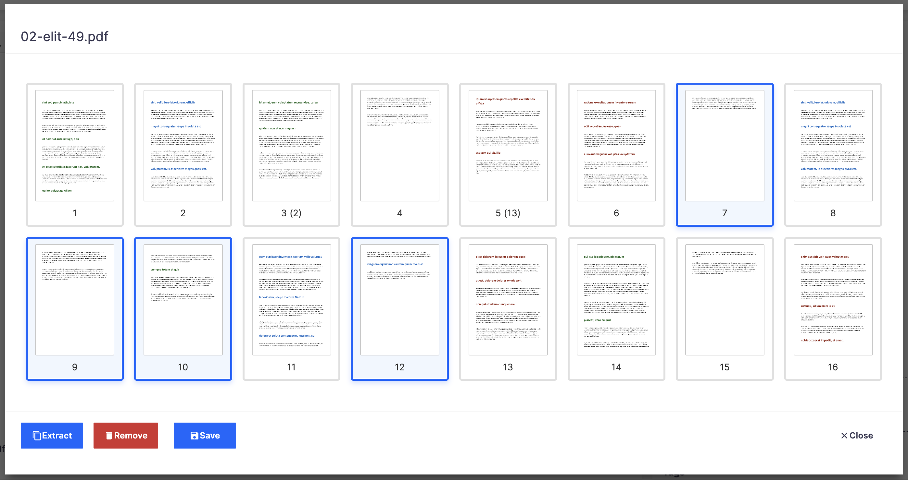

# nuxeo-labs-pdf-toolkit

The plugin displays a "PDF Toolkit" button for documents which have a `file:content` blob whose mime type is "application/pdf" (see below how to override this button). Clicking this button displays dialog with the thumbnails of the pages of a PDF.



Users can:

* Select 1-N pages (with command/ctrl-clic and shift-click)
* Reorganize pages by drag-drop

Users can then:

* Extract selected page(s)
* Remove selected page(s)
* Generate pdf with the new page order

For now, **each of these actions downloads the resulting PDF**. Original Document is never modified.

Also, double-click on a thumbnail displays a bigger preview of the page.

<br />

## Tuning the UI

### The "PDF Toolkit" Button

The plugin deploys a contribution to the DOCUMENTS_ACTION slot (see [nuxeo-pdf-toolkit-bundle.html](nuxeo-labs-pdf-toolkit-webui/src/main/resources/web/nuxeo.war/ui/nuxeo-pdf-toolkit/nuxeo-pdf-toolkit-bundle.html)).

To override it, copy the contribution and tune it, typically in your Studio project custom bundle. Here are some examples:

* To disable it:

```html
<nuxeo-slot-content name="pdfToolkit" slot="DOCUMENT_ACTIONS" order="1" disabled>
</nuxeo-slot-content>
```

* To change the icon (default is `icons:build`), add the `icon` attribute to the call to `nuxeo-pdf-toolkit`:

```html
<nuxeo-slot-content name="pdfToolkit" slot="DOCUMENT_ACTIONS" order="1">
  . . .
        <nuxeo-pdf-toolkit document="[[document]]" icon="nuxeo:search"></nuxeo-pdf-toolkit>
  . . .
</nuxeo-slot-content>
```

* To change the filter, display the button only for  `Contract`(and keep the text on "application/pdf"):

```html
<nuxeo-slot-content name="pdfToolkit" slot="DOCUMENT_ACTIONS" order="1">
  <template>
    <nuxeo-filter document="[[document]]" type="Contract" expression="document.properties[&quot;file:content&quot;] !&#x3D;&#x3D; null &amp;&amp; document.properties[&quot;file:content&quot;][&quot;mime-type&quot;] &#x3D;&#x3D;&#x3D; &quot;application/pdf&quot;" user="[[user]]">
    . . .
</nuxeo-slot-content>
```

<br />

### The Whole Dialog Itself

If you want to tune the dialog, you must import it in your Studio project, and it must be created at the correct place, so it overrides the file deployed by the plugin. Notice the whole plugin actually uses 3 elements, you can tune each of them of course: nuxeo-pdf-toolkit, nuxeo-pdf-toolkit-thumbnails and nuxeo-pdf-toolkit-preview. To override nuxeo-pdf-toolkit, for example, you would do the following:

* Go to Designer > Resources
* Select "UI"
* Create a folder, named "nuxeo-pdf-toolkit"
* Select this "nuxeo-pdf-toolkit" folder, create a new element, named "nuxeo-pdf-toolkit.html"
* Paste the whole content of the original file
* Tune it as needed.

<br />

### Translation Keys

The plugin provides UI in EN and FR thanks to translation keys. If you want the UI in a different language, you can add your own messages-{language}.json file (to you Studio Project > Designer > Translations, typically). The keys to use are [here](/nuxeo-labs-pdf-toolkit-webui/src/main/resources/web/nuxeo.war/ui/i18n).

## Operations

Every action of the dialog is backed by an operation that can be used, of course, outside the context of this UI:

* PDFLabs.GetThumbnails
* PDFLabs.JpegImagePreview
* PDFLabs.ExtractPagesByRange
* PDFLabs.RemovePages
* PDFLabs.ReorderPages

### `PDFLabs.GetThumbnails`

Returns a JSON array of Base64 encoded jpeg thumbnails (so the result can be used directly in an ` [!WARNING]
> As all is in memory as base64, don't use big images and high dpi

<br />

### `PDFLabs.JpegImagePreview`

Returns a `blob`, the jpeg of the preview, size max 1024x1024, and dpi 300.

* Input: Either a `blob` or a `document`. If a `document`, `xpath` is the field to use, `file:content` by default.
* Output: `blob`, the jpeg preview of the page
* Parameters:
  * `xpath`: String, optional, used if input is `document`. `file:content` by default.
  * `pageNumber`: Integer, required. The page to preview, starting at 1. If it is an invalid page number, a Java `IllegalArgumentException` is thrown.
  * `asBase64`: Boolean, optional (default `false`). If `ture`, returns instead a text blob of the base64 encoding of the image.

<br />

### `PDFLabs.ExtractPagesByRange`

Returns a `blob`, a pdf containing the extracted page(s).

* Input: Either a `blob` or a `document`. If a `document`, `xpath` is the field to use, `file:content` by default.
* Output: `blob`, the pdf with the extracted pages
* Parameters:
  * `xpath`: String, optional, used if input is `document`. `file:content` by default.
  * `pageRange`: String, required. Formated as in a print dialog, with pages starting at 1. For example:
    * '2-5' extracts page 2 to 5 (inclusive)
    * '2-5,8, 10-14' extracts pages 2 to 5, 8 and 10 to 14

If `pageRange` is malformed, a Java `IllegalArgumentException` is thrown. Maformed means a page number is < 1, or > number of pages, or a start page is > endPage ("10-2"), etc.

> [!NOTE]
> There also is a `PDF.ExtractPages` operation provided by the platform, which accepts only a start-end pages.

<br />

### `PDFLabs.RemovePages`

Returns a `blob`, a pdf containing the pdf without the page(s) removed.

* Input: Either a `blob` or a `document`. If a `document`, `xpath` is the field to use, `file:content` by default.
* Output: `blob`, the pdf with the page(s) removed
* Parameters:
  * `xpath`: String, optional, used if input is `document`. `file:content` by default.
  * `pageRange`: String, required. Formated as in a print dialog, with pages starting at 1. For example:
    * '2-5' removes page 2 to 5 (inclusive)
    * '2-5,8, 10-14' removes pages 2 to 5, 8 and 10 to 14

If `pageRange` is malformed, a Java `IllegalArgumentException` is thrown. Maformed means a page number is < 1, or > number of pages, or a start page is > endPage ("10-2"), etc.

<br />

### `PDFLabs.ReorderPages`

Returns a `blob`, a pdf containing the pages having the new page order.

* Input: Either a `blob` or a `document`. If a `document`, `xpath` is the field to use, `file:content` by default.
* Output: `blob`, the pdf with the page(s) removed
* Parameters:
  * `xpath`: String, optional, used if input is `document`. `file:content` by default.
  * `pageOrderJsonStr`: String, required. A JSON Array as string, with the number of the current pages, reorganized in the array. For example, `"[3,1,4,2]"` => moves page 3 to first, page 1 to second, etc.
    * It is possible to generate a new page order with less pages. For example, if the PDF has 10 pages, it is OK to pass "[3,1,4,2]", it will create a 4 pages PDF.

<br />

## To Do - Possibly

* Actions with the resulting pdf:
  * Store in file content (replkace current pdf), with opetionaly creating a version before
  * Add to files:files,
  * Create a new document (a derivative)
    * With keeping the relation in a field?
* Generating the thumbnails or the preview is not cached. So, displaying 3 times the same PDF makes Nuxeo calculate thumbnails 3 times. This could be optimized using one among different Nuxeo caches.

<br />

## How to build
```bash
git clone https://github.com/nuxeo-sandbox/nuxeo-labs-pdf-toolkit
cd nuxeo-labs-pdf-toolkit
mvn clean install
```

<br />

## Support
**These features are not part of the Nuxeo Production platform.**

These solutions are provided for inspiration and we encourage customers to use them as code samples and learning
resources.

This is a moving project (no API maintenance, no deprecation process, etc.) If any of these solutions are found to be
useful for the Nuxeo Platform in general, they will be integrated directly into platform, not maintained here.

<br />

## Nuxeo Marketplace
NOT THERE YET
[here](https://connect.nuxeo.com/nuxeo/site/marketplace/package/nuxeo-labs-pdf-toolkit)

<br />

## License
[Apache License, Version 2.0](http://www.apache.org/licenses/LICENSE-2.0.html)

<br />

## About Nuxeo
Nuxeo Platform is an open source Content Services platform, written in Java. Data can be stored in both SQL & NoSQL
databases.

The development of the Nuxeo Platform is mostly done by Nuxeo employees with an open development model.

The source code, documentation, roadmap, issue tracker, testing, benchmarks are all public.

Typically, Nuxeo users build different types of information management solutions
for [document management](https://www.nuxeo.com/solutions/document-management/), [case management](https://www.nuxeo.com/solutions/case-management/),
and [digital asset management](https://www.nuxeo.com/solutions/dam-digital-asset-management/), use cases. It uses
schema-flexible metadata & content models that allows content to be repurposed to fulfill future use cases.

More information is available at [www.nuxeo.com](https://www.nuxeo.com).
