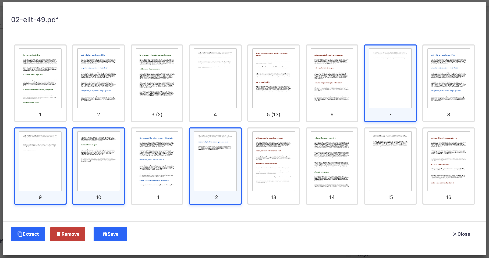
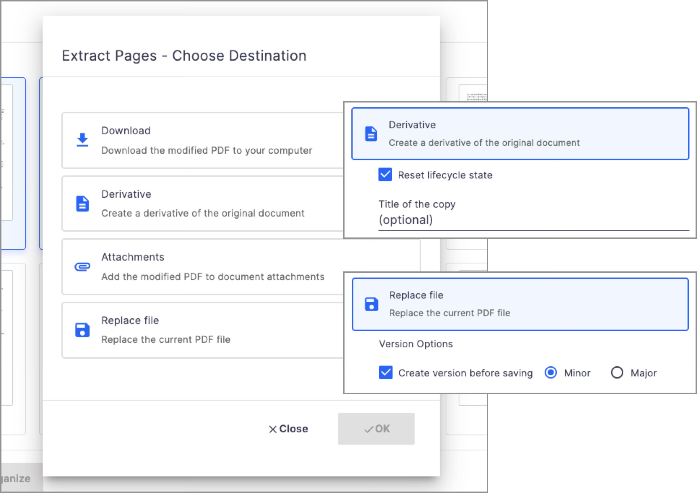

# nuxeo-labs-pdf-toolkit

The plugin displays a "PDF Toolkit" button for documents which have a `file:content` blob whose mime type is "application/pdf" (see below how to override this button). Versions and proxies are excluded, since they cannot be modified. Clicking this button displays a dialog with the thumbnails of the pages of the PDF.



Users can then...

* Select 1-N pages (with command/ctrl-clic and shift-click)
* Reorganize pages by drag-drop

...and:

* Extract selected page(s)
* Remove selected page(s)
* Generate pdf with the new page order

When they click one of these buttons, a "Destination" dialog allows for choosing what to do with the resulting PDF:



* **Download** the resulting PDF on their computer.
* **Derivative** creates a derivative of the original document.
  * This creates a copy in the same parent as the current document.
  * Users have (optional) settings available:
    * Reset the lifecycle to its inital state (so, if current document was "Approved", the derivative will be back to "project", for example)
    * Give a title to the copy. If no name is provided, the file name of the resulting blob is used
* **Attachments** save the resulting PDF to `files:files`.
* **Replace file** save the resulting PDF in `file:content`.
  * Users have the option to first create a Minor/Major version

> [!NOTE]
> The "Derivative", "Attachments" and "Replace file" destinations are hidden for users who do not have the `Write` permission on the document. Only "Download" is offered to them.

Also, double-click on a thumbnail displays a bigger preview of the page, with a better rendition.

> [!NOTE]
> After a drag-and-drop, each tile displays its new position followed by its original page number in parentheses, for example `1 (5)`. **Extract and Remove always act on the original page numbers**, since they run on the current PDF, which the drag-and-drop has not modified. Selecting the tile labelled `1 (5)` and clicking "Extract" therefore extracts page 5. Use "Reorganize" to save a new page order.

> [!NOTE]
> Thumbnails and previews are cached in a TransientStore. So, opening the same PDF shortly after the first opening displays the thumbnails very quickly. Displaying the same preview is also faster.

> [!NOTE]
> Long PDF are handled by chunks. Opening the dialog lays out a tile for **every** page right away, then renders their thumbnails 50 pages at a time as you scroll — including when you drag the scrollbar straight to the end. Since every page has its tile from the start, selecting a wide range with shift-click, or dragging a page from the beginning to the very end, keeps working whatever the document length. See "Configuration Properties" to tune the chunk size and the page limit.

<br />

## Tuning the UI

### The "PDF Toolkit" Button

The plugin deploys a contribution to the DOCUMENT_ACTIONS slot (see [nuxeo-pdf-toolkit-bundle.html](nuxeo-labs-pdf-toolkit-webui/src/main/resources/web/nuxeo.war/ui/nuxeo-pdf-toolkit/nuxeo-pdf-toolkit-bundle.html)).

To override it, copy the contribution and tune it, typically in your Studio project custom bundle. Here are some examples:

* To disable it:

```html
<!-- Do not copy the whol <template>, this is not how Polymer-Nuxeo work when loading slot contributions -->
<nuxeo-slot-content name="pdfToolkit" slot="DOCUMENT_ACTIONS" order="1" disabled>
</nuxeo-slot-content>
```

* For more "complex" change (change inside the template):

1. First, totally disable the existing contribution...

```html
<nuxeo-slot-content name="pdfToolkit" slot="DOCUMENT_ACTIONS" disabled></nuxeo-slot-content>
```

2. ...*then* create a new one, with a different name (here, `"demoPdfToolkit"`). Copy all the current contribution, then modify it.

* To change the icon (default is `icons:build`), add the `icon` attribute to the call to `nuxeo-pdf-toolkit`:

```html
<nuxeo-slot-content name="demoPdfToolkit" slot="DOCUMENT_ACTIONS" order="1">
  . . .
        <nuxeo-pdf-toolkit document="[[document]]" icon="nuxeo:search"></nuxeo-pdf-toolkit>
  . . .
</nuxeo-slot-content>
```

* To change the filter, display the button only for  `Contract`(and keep the text on "application/pdf"):

```html
<nuxeo-slot-content name="demoPdfToolkit" slot="DOCUMENT_ACTIONS" order="1">
  <template>
    <nuxeo-filter document="[[document]]" type="Contract" expression="document.properties[&quot;file:content&quot;] !&#x3D;&#x3D; null &amp;&amp; document.properties[&quot;file:content&quot;][&quot;mime-type&quot;] &#x3D;&#x3D;&#x3D; &quot;application/pdf&quot;" user="[[user]]">
    . . .
</nuxeo-slot-content>
```

<br />

### Element Attributes

`<nuxeo-pdf-toolkit>` accepts the following attributes. They are set on the element inside the slot contribution, as shown in the `icon` example above.

| Attribute | Default | Description |
| --- | --- | --- |
| `document` | — | The document to work on. Required. |
| `icon` | `icons:build` | Icon of the action button. |
| `label` | `PDF Toolkit` | Label of the button, used as a translation key and as the tooltip. |
| `showLabel` | `false` | Display the label next to the icon. |
| `thumbnailWidth` | `256` | Max width, in pixels, of the thumbnails asked of the server. Snapped to the size ladder, see "Rendering sizes are snapped to a ladder". |
| `thumbnailHeight` | `256` | Max height, in pixels. The CSS displays the tiles at 120px, so 256 still covers a high density screen. |
| `thumbnailDpi` | `72` | Rendering resolution, snapped to `72`, `150` or `300`. **The rendering cost grows with the square of the dpi**, so this is the setting to change if the grid is slow to fill — not the width and height, which barely matter. |
| `debug` | `false` | Trace the chunk loading in the browser console. Can also be turned on without touching Studio, with `window.NUXEO_PDF_TOOLKIT_DEBUG = true` or `localStorage.setItem('NUXEO_PDF_TOOLKIT_DEBUG', '1')`. See "Checking the chunking". |

The `thumbnail*` attributes only affect this dialog. The defaults of the operations themselves stay at 512 px / 150 dpi, so Studio projects and scripts calling `PDFLabs.PrepareThumbnails` or `PDFLabs.GetThumbnails` are not impacted.

Example, sharper thumbnails and console traces:

```html
<nuxeo-slot-content name="demoPdfToolkit" slot="DOCUMENT_ACTIONS" order="1">
  . . .
        <nuxeo-pdf-toolkit document="[[document]]" thumbnail-width="512" thumbnail-height="512"
                           thumbnail-dpi="150" debug></nuxeo-pdf-toolkit>
  . . .
</nuxeo-slot-content>
```

Note the attribute names are dash-cased (`thumbnail-width`), as always in Polymer.

<br />

### The Whole Dialog Itself

If you want to tune the dialog, you must import it in your Studio project, and it must be created at the correct place, so it overrides the file deployed by the plugin. Notice the whole plugin actually uses several elements, you can tune each of them of course (see [here](/nuxeo-labs-pdf-toolkit-webui/src/main/resources/web/nuxeo.war/ui/nuxeo-pdf-toolkit)). To override only nuxeo-pdf-toolkit, for example, you would do the following:

* Go to Designer > Resources
* Select "UI"
* Create a folder, named "nuxeo-pdf-toolkit"
* Select this "nuxeo-pdf-toolkit" folder, create a new element, named "nuxeo-pdf-toolkit.html"
* Paste the whole content of the original file
* Tune it as needed.

<br />

### Translation Keys

The plugin provides UI in EN and FR thanks to translation keys. If you want the UI in a different language, you can add your own messages-{language}.json file (to you Studio Project > Designer > Translations, typically). The keys to use are [here](/nuxeo-labs-pdf-toolkit-webui/src/main/resources/web/nuxeo.war/ui/i18n).

## Operations

Every action of the dialog is backed by an operation that can be used, of course, outside the context of this UI:

* PDFLabs.GetThumbnails
* PDFLabs.PrepareThumbnails
* PDFLabs.JpegImagePreview
* PDFLabs.ExtractPagesByRange
* PDFLabs.RemovePages
* PDFLabs.ReorderPages

### `PDFLabs.PrepareThumbnails`

This is the operation the dialog uses, and the one to prefer when displaying thumbnails. It renders **one chunk of pages** (50 by default), fills the server side cache, and returns one URL per page of the document instead of a base64 payload. The images are then fetched by the browser, which can cache them.

Only the chunk holding `startPage` is rendered, so a 1000 pages PDF opens as fast as a 50 pages one. The URLs of **all** the pages are returned nonetheless, so the caller can lay out its placeholders at the right size and call the operation again, with another `startPage`, as the user scrolls.

* Input: a `document` (an URL needs a document id — use `PDFLabs.GetThumbnails` when all you have is a blob).
* Output: JSON `blob`, `{"pageCount": n, "chunkSize": n, "chunkStart": n, "chunkEnd": n, "rendered": true|false, "renderTimeMs": n, "urls": [...]}`.
* Parameters:
  * `xpath`: String, optional. `file:content` by default.
  * `startPage`: Integer, optional. Default 1. Any page of the wanted chunk — it is snapped to the start of its chunk, so 1 and 50 both render the first chunk when the chunk size is 50.
  * `width`: Integer, optional. Default 512, maximum 2000. Snapped to the size ladder.
  * `height`: Integer, optional. Default 512, maximum 2000. Snapped to the size ladder.
  * `dpi`: Integer, optional. Default 150, maximum 300. Snapped to `72`, `150` or `300`.

`rendered` and `renderTimeMs` are diagnostics: `"rendered": false` means the chunk came straight from the cache, so **the PDF was not opened at all**. They are visible in the browser network tab, which is the quickest way to check the chunking on a running server.

The URLs are **relative to the Nuxeo application root**, prefix them with the server base URL:

```json
{
  "pageCount": 2,
  "chunkSize": 50,
  "chunkStart": 1,
  "chunkEnd": 2,
  "rendered": true,
  "renderTimeMs": 47,
  "urls": [
    "site/pdftoolkit/thumb/8a7e.../1?w=512&h=512&dpi=150&v=d41d8cd98f00b204e9800998ecf8427e",
    "site/pdftoolkit/thumb/8a7e.../2?w=512&h=512&dpi=150&v=d41d8cd98f00b204e9800998ecf8427e"
  ]
}
```

The `v` parameter is the **digest of the PDF**. It makes the URL content-addressed: replacing `file:content` produces different URLs, so the browser fetches the new thumbnails instead of serving the previous ones from its cache. It is not used to choose what is served — the endpoint always returns the current content of the document — only to decide how long the response may be cached.

Each URL is served by the plugin REST endpoint, `GET /nuxeo/site/pdftoolkit/thumb/{docId}/{pageNumber}`, which:

* resolves the document through the **current user session**, so the read permission is enforced by the repository — a user who cannot read the document gets a 403 or a 404, never an image, and warming the cache as an administrator does not change that;
* only **reads** the cache filled by the operation on the nominal path — it never reopens the PDF, which is what makes serving a long document cheap;
* falls back on rendering the **whole chunk** holding the page — never that single page — if the cache entry expired in the meantime, and takes a lock so that several browser connections hitting the same cold chunk only trigger one rendering;
* sends an `ETag` in every case, plus `Cache-Control: private, max-age=3600` when `v` is present, or `private, no-cache` when it is not — a plain URL is then revalidated on each request, which costs a `304` rather than a full transfer;
* answers `400` for a request it cannot honour (the document has no blob at that `xpath`, the blob is not a PDF, the property does not exist) and `404` for an unknown document or a page beyond the end of the PDF.

> [!NOTE]
> Serving every page of a document costs one PDF opening **per chunk**, never one per page: 20 openings for a 1000 pages PDF with the default chunk size. See "Checking the chunking" below to observe it.

<br />

### Checking the chunking

Four ways, from the least to the most intrusive.

**1. The browser network tab.** Look at the response of `PDFLabs.PrepareThumbnails`: `"rendered": true` means the PDF was opened and that chunk rendered, `"rendered": false` means it came from the cache. Scrolling through a document must produce one call per chunk, and the thumbnail image requests themselves must never trigger a rendering.

**2. The `debug` attribute** on `<nuxeo-pdf-toolkit>` (see "Element Attributes"). It traces the whole client side chain in the browser console, which is the only way to see why a tile stays empty.

Setting the attribute means editing the slot contribution in Studio, so for a one-off investigation use one of these instead, in the browser console, **before opening the dialog**:

```js
window.NUXEO_PDF_TOOLKIT_DEBUG = true;                          // this page only
localStorage.setItem('NUXEO_PDF_TOOLKIT_DEBUG', '1');           // survives a reload
```

Both are re-read every time the dialog opens. Output looks like:

```
[pdf-toolkit] scan: 24 visible pages without an image (151..174)
[pdf-toolkit] chunk 151 queued (queue=1)
[pdf-toolkit] chunk 151-200 of 1000 ready, rendered=true in 238ms
[pdf-toolkit] applyChunk 151-200: 50 tiles filled
[pdf-toolkit] chunk 151 skipped (already prepared)
```

**3. `nuxeo.pdftoolkit.verboseRendering=true`** in `nuxeo.conf`. Every rendering is then logged at `warn`, so it shows up without touching the log configuration:

```
Rendered thumbnails 151-200 of 1000 (256x256 @ 72 dpi) in 240 ms for blob "x.pdf", cached: true [prepare].
```

The `[...]` marker says what triggered it: `prepare` on the nominal path, `endpoint-fallback` if the browser asked for a page whose chunk had expired, `full-document` for `PDFLabs.GetThumbnails`. An `endpoint-fallback` is always logged at `warn`, even with the property off, because it should not happen on the nominal path.

**4. The log configuration.** The plugin lives in the `nuxeo.labs.pdf.toolkit` package, which **no `<Logger>` of the stock Nuxeo `log4j2.xml` covers** — it therefore inherits the root logger, at `warn`, and all its `info` messages are dropped. To see them without the property above, add to `$NUXEO_HOME/lib/log4j2.xml`:

```xml
<Logger name="nuxeo.labs.pdf.toolkit" level="info" />
```

That file carries `monitorInterval="30"`, so the change is picked up within 30 seconds, no restart needed. Use `level="debug"` to also see the cache hits.

<br />

### `PDFLabs.GetThumbnails`

Returns a JSON array of Base64 encoded jpeg thumbnails. To use one in an ` [!NOTE]
> Prefer `PDFLabs.PrepareThumbnails` to display thumbnails: it does not build the whole payload in memory and lets the browser cache the images. `PDFLabs.GetThumbnails` remains useful when the input is a blob rather than a document, or in a scripting context where a single call is simpler.

* Input: Either a `blob` or a `document`. If a `document`, `xpath` is the field to use, `file:content` by default.
* Output: JSON Array `blob` of the ordered thumbnails, jpeg, as base64.
* Parameters:
  * `xpath`: String, optional, used if input is `document`. `file:content` by default.
  * `width`: Integer, optional. The max. width of each thumbnail. Default value is 512, maximum 2000.
  * `height`: Integer, optional. The max. height of each thumbnail. Default value is 512, maximum 2000.
  * `dpi`: Integer, optional. The dpi to use when creating the images. Default value is 150, maximum 300.

Values are snapped down to the rendering ladder (see "Rendering sizes are snapped to a ladder"), and values above the maximum are clamped rather than rejected.

> [!WARNING]
> As all is in memory as base64, this operation is limited twice: it fails on a PDF holding more than 150 pages (see "Configuration Properties" below to change this limit), and it fails as soon as the thumbnails exceed 5 MB, since the base64 payload and its copies cost about four times that in heap. `PDFLabs.PrepareThumbnails` has no such constraint, it renders by chunks.

<br />

### `PDFLabs.JpegImagePreview`

Returns a `blob`, the jpeg of the preview, size max 2048x2048, and dpi 300.

* Input: Either a `blob` or a `document`. If a `document`, `xpath` is the field to use, `file:content` by default.
* Output: `blob`, the jpeg preview of the page
* Parameters:
  * `xpath`: String, optional, used if input is `document`. `file:content` by default.
  * `pageNumber`: Integer, required. The page to preview, starting at 1. If it is an invalid page number, a Java `IllegalArgumentException` is thrown.
  * `asBase64`: Boolean, optional (default `false`). If `true`, returns instead a text blob of the base64 encoding of the image.

<br />

### `PDFLabs.ExtractPagesByRange`

Returns a `blob`, a pdf containing the extracted page(s).

* Input: Either a `blob` or a `document`. If a `document`, `xpath` is the field to use, `file:content` by default.
* Output: `blob`, the pdf with the extracted pages
* Parameters:
  * `xpath`: String, optional, used if input is `document`. `file:content` by default.
  * `pageRange`: String, required. Formated as in a print dialog, with pages starting at 1. For example:
    * '2-5' extracts page 2 to 5 (inclusive)
    * '2-5,8, 10-14' extracts pages 2 to 5, 8 and 10 to 14.
  * `destinationJsonStr`, string, optional (default to "download"). See below "The `destinationJsonStr` parameter".

The extracted pages always keep their original document order, whatever the order used in the range string: `'8,2-4'` and `'2-4,8'` both produce pages 2, 3, 4, 8. Use `PDFLabs.ReorderPages` to obtain an arbitrary page order.

If `pageRange` is malformed, a Java `IllegalArgumentException` is thrown. Malformed means a page number is < 1, or > number of pages, or a start page is > endPage ("10-2"), etc.

> [!NOTE]
> There also is a `PDF.ExtractPages` operation provided by the platform, which accepts only a start-end pages.

<br />

### `PDFLabs.RemovePages`

Returns a `blob`, a pdf containing the pdf without the page(s) removed.

* Input: Either a `blob` or a `document`. If a `document`, `xpath` is the field to use, `file:content` by default.
* Output: `blob`, the pdf with the page(s) removed
* Parameters:
  * `xpath`: String, optional, used if input is `document`. `file:content` by default.
  * `pageRange`: String, required. Formated as in a print dialog, with pages starting at 1. For example:
    * '2-5' removes page 2 to 5 (inclusive)
    * '2-5,8, 10-14' removes pages 2 to 5, 8 and 10 to 14.
  * `destinationJsonStr`, string, optional (default to "download"). See below "The `destinationJsonStr` parameter".

If `pageRange` is malformed, a Java `IllegalArgumentException` is thrown. Malformed means a page number is < 1, or > number of pages, or a start page is > endPage ("10-2"), etc.

<br />

### `PDFLabs.ReorderPages`

Returns a `blob`, a pdf containing the pages having the new page order.

* Input: Either a `blob` or a `document`. If a `document`, `xpath` is the field to use, `file:content` by default.
* Output: `blob`, the pdf with the page(s) removed
* Parameters:
  * `xpath`: String, optional, used if input is `document`. `file:content` by default.
  * `pageOrderJsonStr`: String, required. A JSON Array as string, with the number of the current pages, reorganized in the array. For example, `"[3,1,4,2]"` => moves page 3 to first, page 1 to second, etc.
    * It is possible to generate a new page order with less pages. For example, if the PDF has 10 pages, it is OK to pass "[3,1,4,2]", it will create a 4 pages PDF.
  * `destinationJsonStr`, string, optional (default to "download"). See below "The `destinationJsonStr` parameter".

<br />

### The `destinationJsonStr` parameter

* When not passed, the default is "download", and the operation returns the Blob of the resulting PDF.
* When passed it must have at least one property, `destination` whose (case insensitive) value can be: `"download"`, `"derivative"`, `"attachments"` or `"newFile"`.

For some destination, an extra `details`field, object, can be passed (optional):

* When `"derivative"`, `details` can have:
  * `"resetLifeCycle"`, a boolean, `false` by default.
  * `"derivativeTitle"`, string, the title to use for the copy. Default is the resulting PDF file name. A title holding a `/` is accepted: it is kept as `dc:title` and normalized for the document name.
* When `"attachments"`, `details` can have an `xpath` value, the field of type multivalued Blob where to append the resulting PDF. Default is `files:files`. The field **must** be a multivalued *blob* field: the operation fails explicitly on a single-valued blob field, rather than silently overwriting it, and on a multivalued field that does not hold blobs (`dc:subjects`, say).
* When `"newFile"`, `details` can have:
  *`"createVersion"`, boolean, default `false`.
  * If `createVersion` is `true`, another property `versionType`, string, must be either "Minor" or "Major" (defaults to `Minor`).

Here are some examples (don't forget to `JSON.stringify` before calling the operation):

* Derivative with lifecycle reset and custom title:

```json
{
  "destination": "derivative",
  "details": {
    "resetLifeCycle": true,
    "derivativeTitle": "My doc extracted pages"
  }
}
```

* Save to file, no version created:

```json
{
  "destination": "newFile"
}
```

Save to file, create minor version:

```json
{
  "destination": "newFile",
  "details": {"createVersion": true}
}
```

* Save to file, create major version:

```json
{
  "destination": "newFile",
  "details": {
    "createVersion": true,
    "versionType": "major"
  }
}
```

<br />

## Configuration Properties

| Property | Default | Description |
| --- | --- | --- |
| `nuxeo.pdftoolkit.thumbnails.chunkSize` | 50 | Number of pages rendered in one go by `PDFLabs.PrepareThumbnails`. This is the unit of work of the whole thumbnails pipeline: the PDF is opened, parsed and rendered once per chunk, **never once per page**. Lower it for a snappier scroll, raise it to fetch the blob from the storage less often. |
| `nuxeo.pdftoolkit.thumbnails.maxPages` | 2000 | Maximum number of pages `PDFLabs.PrepareThumbnails` accepts to expose. Rendering is bounded by the chunk, so this is not about the server: every page becomes a tile in the dialog, and a few thousand tiles are enough to freeze a browser tab. |
| `nuxeo.pdftoolkit.maxPages` | 150 | Maximum number of pages `PDFLabs.GetThumbnails` accepts to render. The whole result is built in memory as base64, so raise this only if your server can afford it. **Does not apply to `PDFLabs.PrepareThumbnails`**, which renders by chunks, nor to `ExtractPagesByRange`, `RemovePages` and `ReorderPages`, which never rasterize anything. |
| `nuxeo.pdftoolkit.cache.targetMaxSizeMB` | 500 | Target size of the `PDFToolkitCache` transient store holding the thumbnails and the previews. The dialog asks for 256px thumbnails, so a 1000 pages PDF occupies roughly 10 to 15 MB. |
| `nuxeo.pdftoolkit.cache.absoluteMaxSizeMB` | 600 | Hard size limit of the same store. A full cache never fails a request, it only disables caching. |
| `nuxeo.pdftoolkit.verboseRendering` | `false` | Log every chunk rendering at `warn` instead of `info`. Useful because the plugin package is not covered by the stock `log4j2.xml`, so its `info` messages are invisible by default. See "Checking the chunking". |
| `nuxeo.transientstore.rendition.cache.ttl` | 240 | First level TTL, in minutes, shared with the rendition cache. |

All these have defaults, so the plugin handles a 1000 pages PDF out of the box, with no `nuxeo.conf` entry.

<br />

### Rendering limits

On top of the properties above, a few limits are hardcoded because they protect the server rather than tune it. They are not configurable on purpose.

| Limit | Value | Why |
| --- | --- | --- |
| Max PDF size | 200 MB | PDFBox loads the document in memory. |
| Max dpi | 300 | Above this a single page can exhaust the heap. |
| Max thumbnail side | 2000 px | Same reason. |
| Max pixels per rendered page | 40 million (~160 MB) | Absolute ceiling, whatever the page size, the dpi and the requested thumbnail size. |

That last one matters more than it looks. The cost of rendering a page is driven by the **page geometry**, which comes from the file — and the PDF format allows a 200 x 200 inches page in a file of a few hundred bytes. Asking for a 256 px thumbnail of such a page used to make PDFBox allocate several hundred megabytes, or simply run out of memory, so a tiny file was enough to bring a server down.

The plugin now derives the rendering scale from the **requested output size**, using the dpi only as an upper bound: a page larger than the target is rendered smaller than the dpi asks for. Normal page sizes are unaffected — a Letter or A4 page still renders exactly as before — and large-format documents (plans, posters, maps) simply became much faster.

<br />

### Rendering sizes are snapped to a ladder

`width`, `height` and `dpi` are **snapped down** to the closest of these values:

* sizes: `120`, `256`, `512`, `1024`, `2000`
* dpi: `72`, `150`, `300`

So asking for `width=700` renders at 512, and `dpi=110` renders at 72. Values below the first step use it as a floor, values above the last one are capped there.

This is a safety measure, not a tuning one. The rendering parameters are part of the cache key, so accepting arbitrary values means that varying a query string one pixel at a time (`?w=1`, `?w=2`, `?w=3`…) forces an unbounded number of chunk renderings, each of which opens the PDF, rasterizes up to 50 pages and writes them to a cache that then thrashes. Snapping bounds the distinct renderings of one document to 5 x 5 x 3.

Pick a value from the ladder when you set `thumbnailWidth` / `thumbnailHeight` / `thumbnailDpi` on the element or `width` / `height` / `dpi` on an operation, otherwise you pay for the step below the one you expected.

<br />

## Installation

The plugin is available on [Nuxeo MarketPlace](https://connect.nuxeo.com/nuxeo/site/marketplace/package/nuxeo-labs-pdf-toolkit). So you can

* Add it as a dependency of your Nuxeo Studio project (Modeler > Settings > Application Definition)
* Add it to `NUXEO_PACKAGES` in your Docker toolling
* Or use `nuxeoctl mp-install nuxeo-labs-pdf-toolkit`
* Or download the package and install it manually: `nuxeoctl mp-install nuxeo-labs-pdf-toolkit-{plugin version}`

<br />

## Supported versions

**Only LTS 2025 is maintained**, on the `master` branch.

An `lts2023` branch exists and a build of it is on the Marketplace, but it is frozen: it receives no
fix, no back-port and no support. In particular it does **not** carry the rendering bounds described
in "Rendering limits" above, so a single crafted PDF can exhaust the heap of a server running it.
If you are on LTS 2023 and use this plugin, treat that branch as end-of-life and plan an upgrade.

<br />

## How to build

```bash
git clone https://github.com/nuxeo-sandbox/nuxeo-labs-pdf-toolkit
cd nuxeo-labs-pdf-toolkit
mvn clean install
```

The Web UI part has standalone checks, for the scroll position of the thumbnails dialog and for the page numbering sent to the operations. They need only `node`, no PDF and no server, and are not part of the Maven build:

```bash
node nuxeo-labs-pdf-toolkit-webui/src/test/js/scroll-harness.js
node nuxeo-labs-pdf-toolkit-webui/src/test/js/selection-harness.js
```

<br />

## Support

**These features are not part of the Nuxeo Production platform.**

These solutions are provided for inspiration and we encourage customers to use them as code samples and learning
resources.

This is a moving project (no API maintenance, no deprecation process, etc.) If any of these solutions are found to be
useful for the Nuxeo Platform in general, they will be integrated directly into platform, not maintained here.

<br />

## License

[Apache License, Version 2.0](http://www.apache.org/licenses/LICENSE-2.0.html)

<br />

## About Nuxeo

Nuxeo Platform is an open source Content Services platform, written in Java. Data can be stored in both SQL & NoSQL
databases.

The development of the Nuxeo Platform is mostly done by Nuxeo employees with an open development model.

The source code, documentation, roadmap, issue tracker, testing, benchmarks are all public.

Typically, Nuxeo users build different types of information management solutions
for [document management](https://www.nuxeo.com/solutions/document-management/), [case management](https://www.nuxeo.com/solutions/case-management/),
and [digital asset management](https://www.nuxeo.com/solutions/dam-digital-asset-management/), use cases. It uses
schema-flexible metadata & content models that allows content to be repurposed to fulfill future use cases.

More information is available at [www.nuxeo.com](https://www.nuxeo.com).
